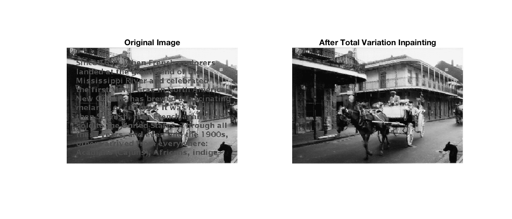

A great application of diffusion processes in partial differential equations are the classic methods for computer vision. In particular, its very nice to observe the impact of using unconditionally and conditionally stable schemes for nonlinear diffusion filtering. I implemented the explicit and semi-implicit methods described in [Weickert et al. (1998)](http://citeseerx.ist.psu.edu/viewdoc/download?doi=10.1.1.469.1140&rep=rep1&type=pdf) [[code]](https://github.com/lkania/nonlinear-diffusion-filtering/blob/master/nonlinear%20diffusion/sol.m). 

Furthermore, a concise write-up on the derivation of an explicit scheme for impainting is available [[brief]](https://github.com/lkania/nonlinear-diffusion-filtering/blob/master/impainting/brief.pdf) with its implementation [[code]](https://github.com/lkania/nonlinear-diffusion-filtering/blob/master/impainting/sol.m). 
